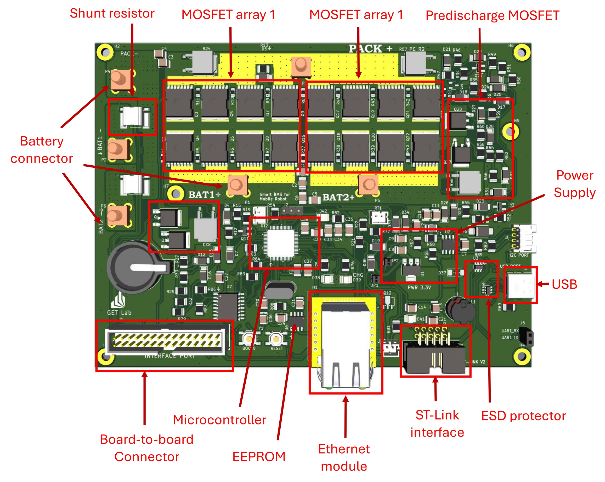
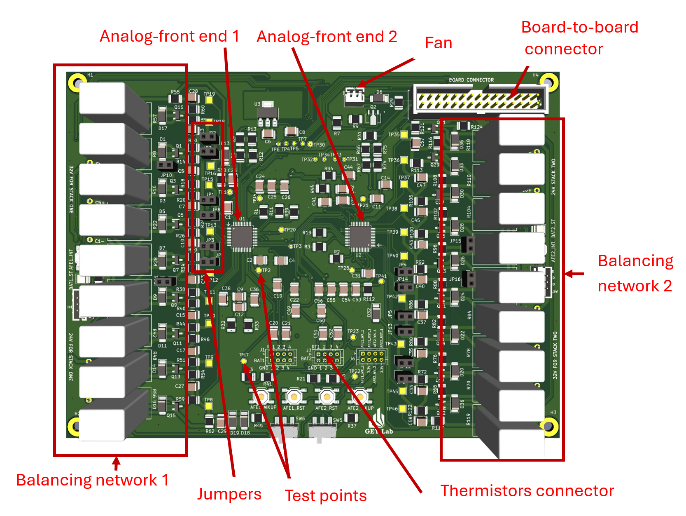
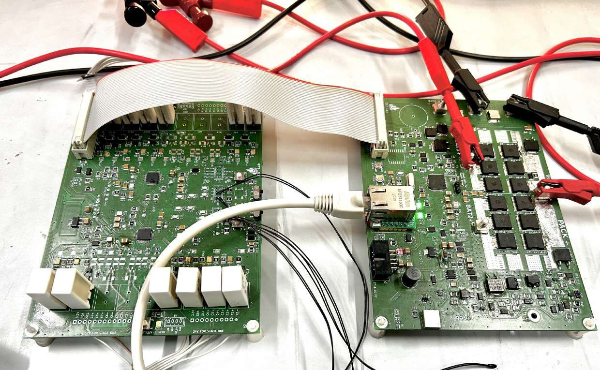

# Battery Management System (BMS) Project

## Overview
This project has been developed using the following software and libraries:

- **ROS 2**
- **libmodbus** - [Official Website](https://libmodbus.org/)
- **STM32CubeIDE v1.15.1**
- **Segger SystemView Software (PC)** - [Download](https://www.segger.com/products/development-tools/systemview/)
- **Segger SystemView Target Source Files v3.20 (Target Board)**
- **FreeRTOS** - Real-time operating system
- **Wiznet W5500 ioLibrary_BSD** - [Documentation](https://docs.wiznet.io/Product/iEthernet/W5500/driver)

**Author:** fokonkwo@mail.upb.de  
**Date:** 15.01.2025  

---

## 1. BMS Directory Structure

```
├── bms
│   ├── bms.ioc
│   ├── Core
│   │   ├── Inc
│   │   │   ├── BQ769x2Header.h
│   │   │   ├── modbus.h
│   │   │   ├── soc.h
│   │   │   ├── spi.h
│   │   │   ├── FreeRTOSConfig.h    // FreeRTOS configuration or customization file
│   │   ├── Src
│   │   │   ├── main.c
│   │   │   ├── modbus.c    // Modbus battery management system --> host robot communication functions
│   │   │   ├── soc.c    // State estimation functions Coulomb counting and extended Kalman filter functions
│   │   │   ├── utils.c
│   │   ├── Startup
│   │   │   └── startup_stm32f446retx.s
│   ├── Drivers
│   │   ├── CMSIS
│   │   ├── STM32F4xx_HAL_Driver
│   ├── ThirdParty
│   │   ├── FreeRTOS-Kernel
│   │   ├── SEGGER    // For task execution trace capture and debugging real time systems
├── bms_gui
│   ├── include
│   │   └── bms_gui
│   │       ├── mainwindow.h
│   │       └── ros2comm.h  
│   ├── src
│   │   ├── main.cpp
│   │   ├── mainwindow.cpp
│   │   └── ros2comm.cpp    / ROS 2 host node for bms--> host communication and gui interface update
├── FreeRTOS11_with_SystemView.pdf
├── qt_gui
│   ├── main.cpp
│   ├── mainwindow.cpp
│   ├── mainwindow.h
│   ├── mainwindow.ui
└── README.md
```

---

## 2. Getting Started

1. Clone or download and unzip the folder.
2. Run `git submodule init && git submodule update` to initialize and update the FreeRTOS submodule.
3. Open **STM32CubeIDE** and import the project into your workspace.
4. Build the project.
   - If the build fails, ensure all paths are correctly set up.
   - Check project configurations and resolve any missing dependencies.

---

## 3. Integrating FreeRTOS

- Manually added FreeRTOS as a submodule.
- To include FreeRTOS in the STM32CubeIDE project:
  - Create a `ThirdParty` directory and include the FreeRTOS kernel.
  - Include these compiler paths:
    ```
    "${workspace_loc:/${ProjName}/ThirdParty/FreeRTOS-Kernel/include}"
    "${workspace_loc:/${ProjName}/ThirdParty/FreeRTOS-Kernel/portable/GCC/ARM_CM4F}"
    ```
- Ensure `sysmem.c` is **excluded** from the build.

---

## 4. Integrating SEGGER SystemView

- Download **Segger SystemView** for PC and target source files.
- Extract source files into `ThirdParty/SEGGER`.
- Modify **FreeRTOSConfig.h** to include:
  ```c
  #include "SEGGER_SYSVIEW_FreeRTOS.h"
  #define INCLUDE_xTaskGetIdleTaskHandle 1
  #define INCLUDE_pxTaskGetStackStart 1
  ```
- Configure SystemView buffer size and enable **DWT_CYCCNT** register for timestamping.
- Include these compiler paths:
  ```
  "${workspace_loc:/${ProjName}/ThirdParty/SEGGER/Config}"
  "${workspace_loc:/${ProjName}/ThirdParty/SEGGER/SEGGER}"
  "${workspace_loc:/${ProjName}/ThirdParty/SEGGER/OS}"
  ```

---

## 5. Integrating W5500 Ethernet Library

- Download and include the **Wiznet W5500 ioLibrary**.
- Edit `wizchip_conf.h`:
  ```c
  #define _WIZCHIP_ W5500
  ```

---

## 6. ROS 2 Host Node and BMS GUI

- **Build the ROS 2 node** using `colcon build`.
- To modify the GUI:
  - Open `qt_gui` in **Qt Creator**.
  - Edit `mainwindow.ui` as needed.
  - Rebuild the ROS 2 node.

---
## 7. Hardware



